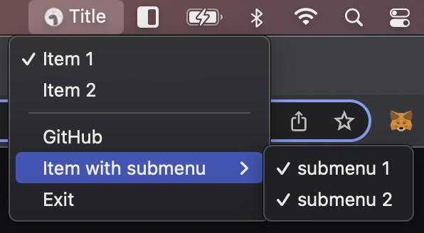

# deno-systray

[](https://nest.land/package/systray)
[](https://github.com/wobsoriano/deno-systray/actions)
[](https://github.com/wobsoriano/deno-systray/releases)
[](https://github.com/wobsoriano/deno-systray/blob/master/LICENSE)

A cross-platform systray library for Deno using the [go systray library](https://github.com/getlantern/systray).



## Usage

```ts
import SysTray from "https://deno.land/x/systray/mod.ts";

const Item1 = {
  title: 'Item 1',
  tooltip: 'The first item',
  // checked is implemented by plain text in linux
  checked: true,
  enabled: true,
  // click is not a standard property but a custom value
  click: () => {
    Item1.checked = !Item1.checked
    systray.sendAction({
      type: 'update-item',
      item: Item1,
    })
  }
}

const Item2 = {
  title: 'Item 2',
  tooltip: 'The second item',
  checked: false,
  enabled: true,
  // add a submenu item
  items: [{
    title: 'Submenu',
    tooltip: 'this is a submenu item',
    checked: false,
    enabled: true,
    click: () => {
      // open the url
      console.log('open the url')
    }
  }]
}

const ItemExit = {
  title: 'Exit',
  tooltip: 'Exit the menu',
  checked: false,
  enabled: true,
  click: () => {
    systray.kill()
  }
}

const systray = new SysTray({
  menu: {
    // Use .png icon in macOS/Linux and .ico format in windows
    icon: Deno.build.os === 'windows' ? './icon.ico' : './icon.png',
    // A template icon is a transparency mask that will appear to be dark in light mode and light in dark mode
    isTemplateIcon:  Deno.build.os === 'darwin',
    title: "Title",
    tooltip: "Tooltip",
    items: [
      Item1,
      Item2,
      SysTray.separator, // SysTray.separator is equivalent to a MenuItem with "title" equals "<SEPARATOR>"
      ItemExit
    ],
  },
  debug: true, // log actions
  directory: 'bin' // cache directory of binary package
});

systray.on('click', (action) => {
  if (action.item.click) {
    action.item.click();
  }
});

systray.on('ready', () => {
  console.log('tray started!');
});

systray.on('exit', () => {
  console.log('exited');
});

systray.on('error', (error) => {
  console.log(error);
});
```

## Try the example app!

```bash
$ deno run -A https://deno.land/x/systray/example/index.ts
```

View [platform notes](https://github.com/getlantern/systray#platform-notes).

## Credits

- https://github.com/getlantern/systray
- https://github.com/zaaack/systray-portable
- https://github.com/felixhao28/node-systray

## License

MIT
